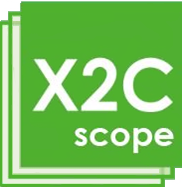

<a href="http://microchip.com"> </a>
<a href="http://x2c.lcm.at"> </a>

---
# X2CScope.github.io
This is the repository of X2Cscope documentation.

It is hosted by Gihub pages at [X2Cscope.github.io](X2Cscope.github.io).

Static page is generated by [Jekyll](https://jekyllrb.com/) with [Just the Docs](https://pmarsceill.github.io/just-the-docs/) theme.

## Quick start

### Dependencies
* [Ruby](https://www.ruby-lang.org/en/downloads/) v2.7 tested - check your Ruby version using ``ruby -v``
* [RubyGems](https://rubygems.org/pages/download) v3.1.4 tested - check your Gems version using ``gem -v``
* [Jekyll](https://jekyllrb.com) v4.2.0 tested - check your Jekyll version using ``jekyll -v``

### Build and run page locally

Run the following commands in the root
```bash
$ bundler exec jekyll build
$ bundler exec jekyll serve 
```