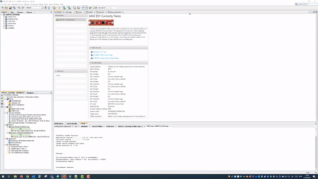

# X2Cscope plugin for MPLAB X

### Content
1. Install X2Cscope plugin within MPLAB X
2. Use X2Cscope plugin
   1. Connect to the Hardware
   2. Watch window features
   3. Scope window features

## Install X2Cscope plugin within MPLAB X

You will need MPLAB X IDE v5.40 or newer. <a href="www.microchip.com/mplabx">www.microchip.com/mplabx</a>

1. Open MPLAB X IDE.
2. Navigate to Tools-->Plugins at the top bar.
3. Slect X2Cscope for install.
4. Restart MPLAB X IDE.

### Use X2Cscope

