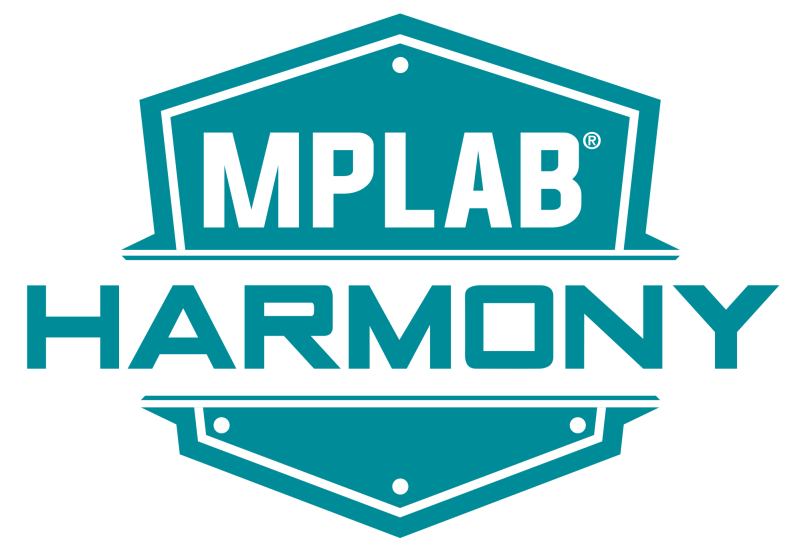

# [X2Cscope firmware with Harmony](https://microchip-mplab-harmony.github.io/x2c/x2c-scope/docs/readme_add_x2cScope_to_your_application.html)
{: .no_toc}

Harmony v3 is a Embedded Software Development Framework for Microchip 32-bit Microcontrollers and Microprocessors.

Harmony v3 official documentation has a detailed X2Cscope section: [X2Cscope Harmony GUIDE](https://microchip-mplab-harmony.github.io/x2c/x2c-scope/docs/readme_add_x2cScope_to_your_application.html).

