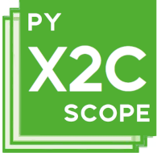
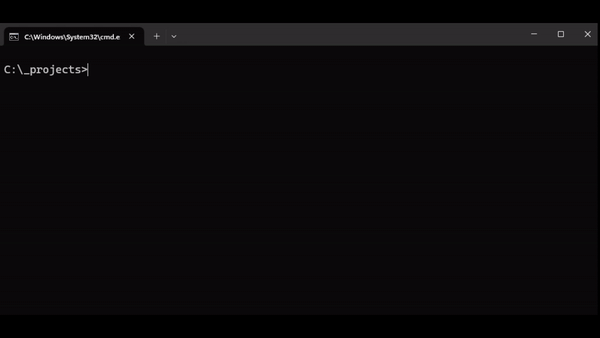

pyX2Cscope is the PC side software implementatio to communicate to the X2C firmware enabled platforms.

Detailed documentation of pyX2Cscope python package: [https://x2cscope.github.io/pyx2cscope/](https://x2cscope.github.io/pyx2cscope/)


# Quick start

```bash
# Create virtual environment
python -m venv .venv
source .venv/Scripts/activate
# Install pyX2Cscope
pip install pyx2cscope
# Start demo GUI
python -m pyx2cscope
```

